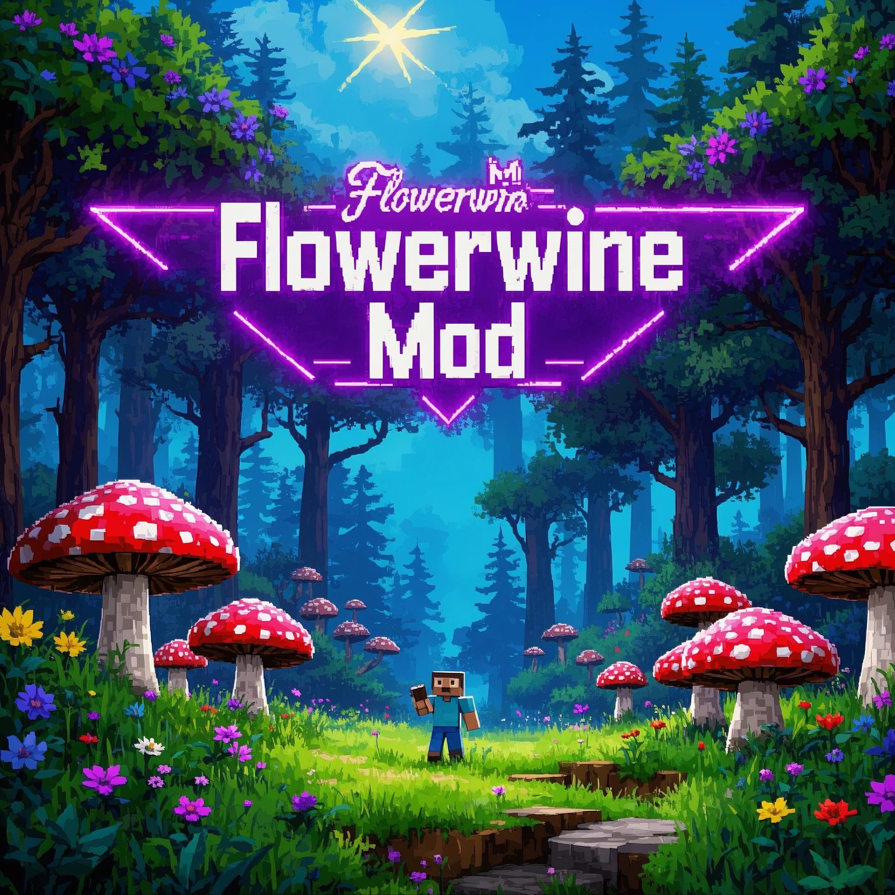

# 🗡️ 剑气模组

这是一个为Minecraft添加剑气效果的模组,让你体验到武侠世界中的剑气纵横!

<p align="center"></p>

## ✨ 主要特性

### 🌟 剑气附魔
- 可以通过附魔台为剑添加剑气附魔
- 附魔等级越高,剑气效果越强大
- 与锋利附魔协同,提升剑气伤害和范围

### ⚔️ 剑气系统
- **普通剑气**: 
  - 短按左键释放月牙形状剑气
  - 可破坏路径上的方块
  - 对生物造成伤害,伤害随距离衰减
  - 剑气颜色随等级变化:蓝色→紫色→红色
  
- **交叉剑气**: 
  - 长按左键蓄力(1秒)后释放交叉剑气
  - 形成X形状的双重剑气
  - 更高的伤害和更大的范围

### 🎮 操作方式
- 短按左键: 释放普通剑气
- 长按左键: 蓄力后释放交叉剑气
- 剑气会随着玩家视角方向释放


### ⚔️ 特色物品
- **魔法棒**
  - 可附魔:万雷、锋利
  - 释放闪电攻击
  - 闪电数量随万雷等级提升
  - 闪电特效随锋利等级变化
- **赌神卡牌**
  - 随机触发各种有趣效果
  - 包含20多种独特事件
  - 事件权重系统
  - 带有粒子效果和音效

### 🎮 游戏机制
- **村民小偷系统**
  - 村民可能成为小偷
  - 偷窃等级成长系统
  - 复杂的AI行为模式
  - 死亡时变成蝙蝠

## 🛠️ 开发环境

- Minecraft: 1.20.1
- Fabric Loader: >= 0.14.24
- Fabric API: >= 0.90.7
- Java: >= 17
- IDE: 推荐使用 IntelliJ IDEA

## 📦 安装说明

1. 安装 Fabric Loader
2. 下载并安装 Fabric API
3. 将本模组放入 mods 文件夹

## 🔧 开发设置

1. 克隆项目

```bash
git clone https://github.com/flower0wine/mod.git
```

2. 导入项目到IDE
3. 运行以下命令设置开发环境:

```bash
./gradlew genSources
./gradlew eclipse # 对于Eclipse
./gradlew idea # 对于IntelliJ IDEA
```

4. 运行游戏:

```bash
./gradlew runClient
```

## 🎮 游戏配置

可以通过修改 `src/main/resources/data/fabricmod/sword_aura/` 目录下的配置文件来调整:
- 剑气伤害
- 移动速度和距离
- 粒子效果
- 其他参数

## 📄 许可证

本项目采用 AGPL-3.0 许可证开源。在 Fabric Mod Example 的基础上修改

## 🤝 贡献

欢迎提交 Issue 和 Pull Request!